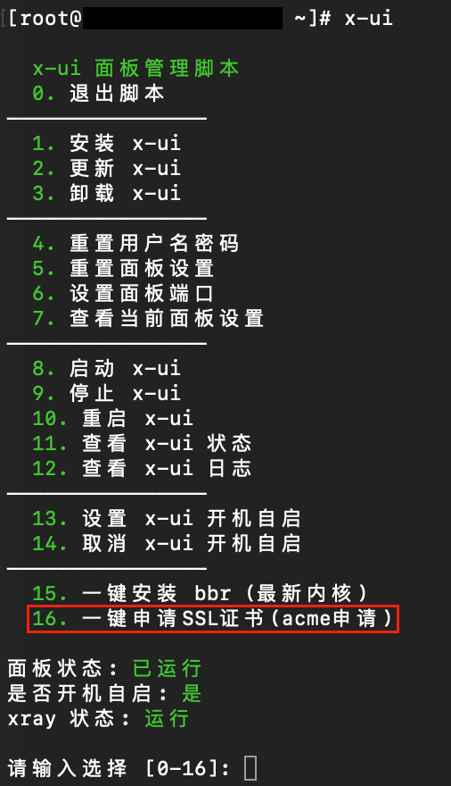
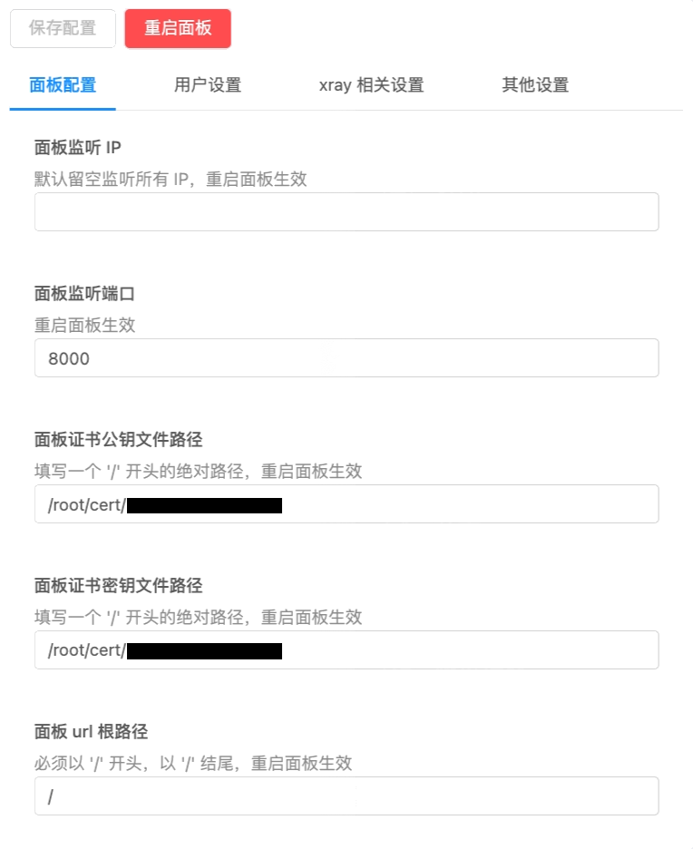
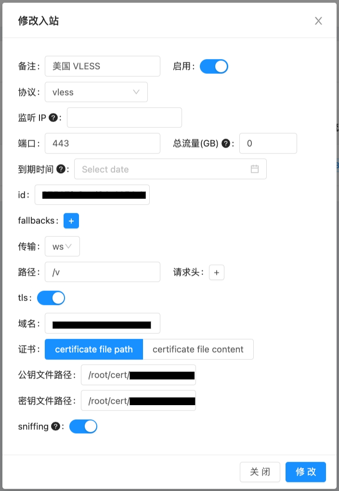
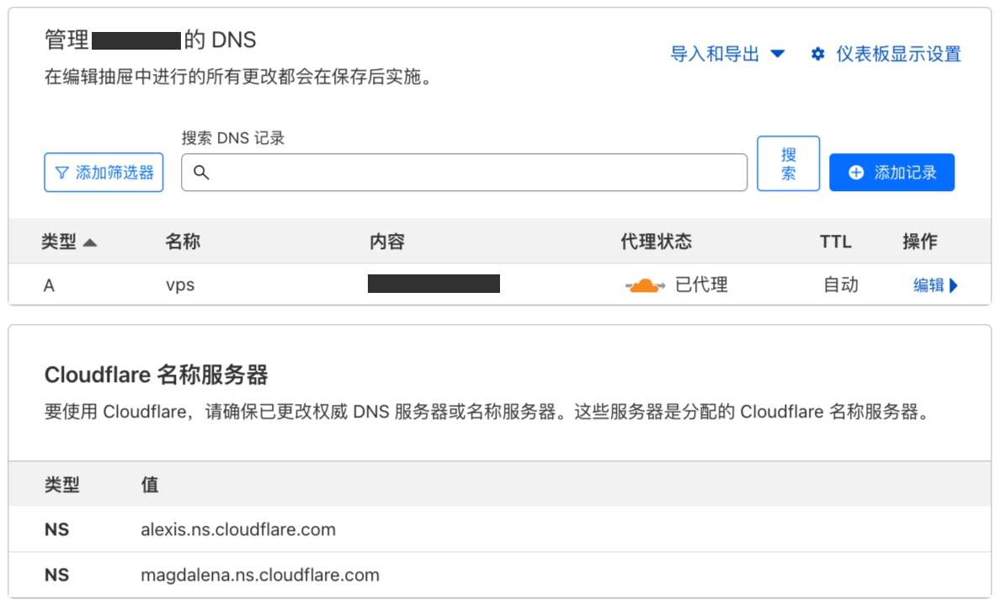
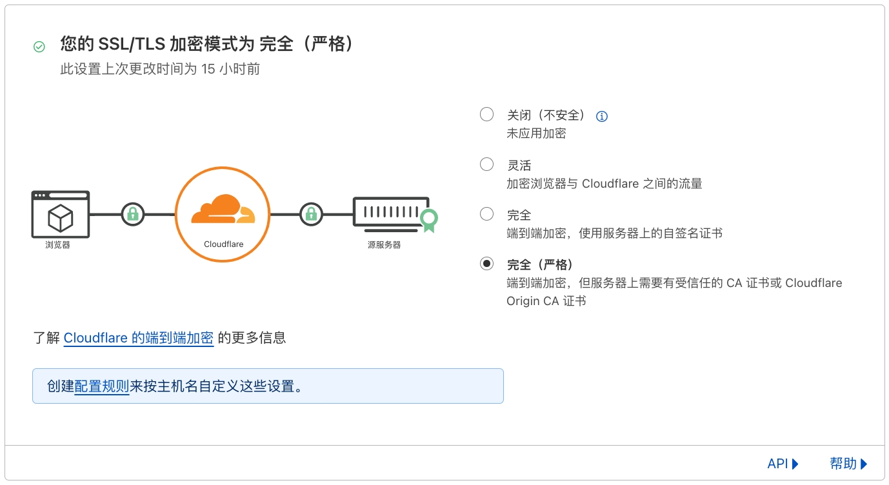
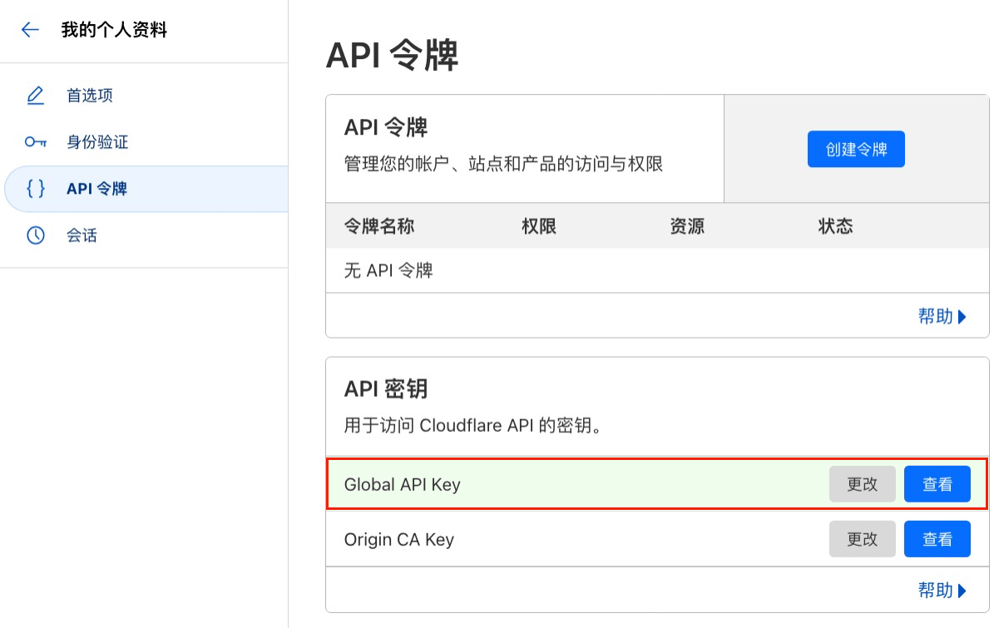
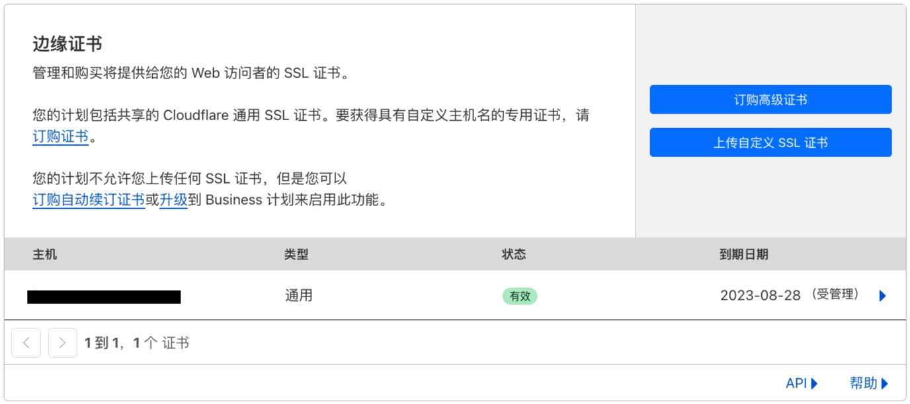

# Server

## [Amazon AWS](https://console.aws.amazon.com)

### Lightsail Instances | Networking

#### Attach static IP

```
Select a static IP to attach | Attach
```

#### IPv4 Firewall

```
Add rule | All protocols | Create
```

*or*

| Application | Protocol | Port or range / Code |
| ---- | ---- | ---- |
| SSH | TCP | 22 |
| HTTP | TCP | 80 |
| HTTPS | TCP | 443 |

#### SSH

```sh
chmod 600 LightsailDefaultKey.pem
ssh -i ./LightsailDefaultKey.pem username@ip

sudo -i
```

*or*

```sh
echo root:123456 | sudo chpasswd root
sudo sed -i 's/^#\?PermitRootLogin.*/PermitRootLogin yes/g' /etc/ssh/sshd_config
sudo sed -i 's/^#\?PasswordAuthentication.*/PasswordAuthentication yes/g' /etc/ssh/sshd_config
sudo reboot

ssh root@ip
```

### CentOS

#### [X-UI](https://github.com/vaxilu/x-ui)

```sh
sudo bash <(curl -Ls https://raw.githubusercontent.com/vaxilu/x-ui/master/install.sh)
```

### Ubuntu

#### [Hiddify](https://github.com/hiddify/hiddify-config)

```sh
sudo apt update && sudo apt install curl && sudo bash -c "$(curl -Lfo- https://i.hiddify.com/release)"
```

```sh
cd /opt/hiddify-manager && sudo bash menu.sh
```

## [Cloudflare](https://dash.cloudflare.com/)

~

## See

- https://zh.wikipedia.org/zh-cn/V2Ray
  - https://xtls.github.io/ ✔
  - https://www.v2fly.org/
- https://hiddify.com/en/

##
##

### Preferences

#### X-UI




#### Cloudflare




